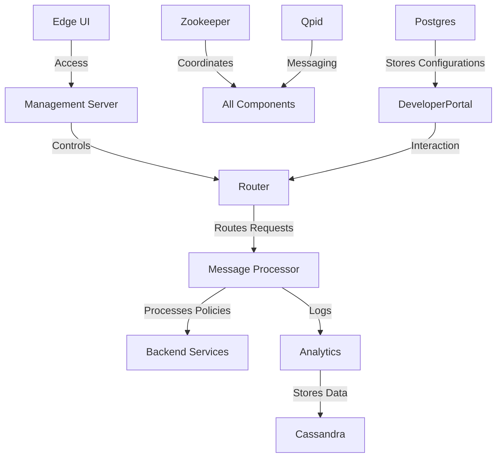

# :label: Apigee QA Environment Setup :building_construction:

## :globe_with_meridians: **Introduction**
As an architect, setting up a QA environment for Apigee involves deploying a combination of components to ensure reliability, scalability, and accurate simulation of the production environment. Below is a brief explanation of the total number of components required and their roles in the QA setup.

---

## :gear: **Apigee Components and Setup in QA Environment**

### 1. **Management Server (MS)**
- **Purpose**: Central control plane to manage APIs, policies, and deployments.
- **Quantity**: 1 instance (clustered if needed for high availability).
- **Reason**: A single instance is sufficient for QA purposes unless additional redundancy is required.

### 2. **Cassandra**
- **Purpose**: Stores API configurations, analytics, and operational metrics.
- **Quantity**: 3 instances.
- **Reason**: Ensures fault tolerance and data replication for consistency and scalability.

### 3. **Zookeeper**
- **Purpose**: Coordinates distributed services and manages cluster state.
- **Quantity**: 3 instances.
- **Reason**: Required for high availability and to maintain cluster stability.

### 4. **Router**
- **Purpose**: Entry point for all API traffic; routes requests to the Message Processor.
- **Quantity**: 2 instances.
- **Reason**: Provides load balancing and redundancy to handle QA traffic effectively.

### 5. **Message Processor (MP)**
- **Purpose**: Processes API requests, applies policies, and communicates with backend services.
- **Quantity**: 2 instances.
- **Reason**: Redundancy ensures fault tolerance and handles concurrent API requests efficiently.

### 6. **Qpid (Apache Qpid)**
- **Purpose**: Facilitates asynchronous communication between Apigee components.
- **Quantity**: 2 instances.
- **Reason**: Ensures smooth communication and avoids bottlenecks during message handling.

### 7. **Edge UI**
- **Purpose**: Web-based graphical interface for managing APIs and monitoring traffic.
- **Quantity**: 1 instance.
- **Reason**: Single instance is sufficient for managing QA environment operations.

### 8. **Analytics**
- **Purpose**: Captures and processes API usage data for real-time and historical analysis.
- **Quantity**: Integrated with Cassandra; no separate instance required.
- **Reason**: Leverages Cassandra for data storage and processing.

### 9. **Developer Portal**
- **Purpose**: Enables API consumers to interact with and test APIs.
- **Quantity**: 1 instance.
- **Reason**: Allows developers to validate APIs in QA.

### 10. **Postgres**
- **Purpose**: Stores lightweight data like configuration and user management.
- **Quantity**: 1 instance.
- **Reason**: One instance is adequate for managing QA-specific configuration data.

### 11. **Management API**
- **Purpose**: Programmatic access for managing Apigee components.
- **Quantity**: Integrated with the Management Server; no separate instance required.
- **Reason**: Provides an interface to automate QA processes.

---

## :chart_with_upwards_trend: **Design Overview**

---

## :clipboard: **Summary of Components**
- **Total Components**: 16 instances across the QA environment.
    - **1 Management Server**
    - **3 Cassandra Nodes**
    - **3 Zookeeper Nodes**
    - **2 Routers**
    - **2 Message Processors**
    - **2 Qpid Nodes**
    - **1 Edge UI**
    - **1 Developer Portal**
    - **1 Postgres Instance**

---

## :bulb: **Key Considerations**
1. **High Availability**: Ensure redundancy for critical components like Cassandra, Zookeeper, and Message Processors.
2. **Scalability**: Configure components to handle traffic spikes and simulate production-like conditions.
3. **Monitoring**: Use Edge UI and Analytics to monitor traffic and identify potential issues before deployment.
4. **Consistency**: Align the QA setup closely with the production environment to identify and resolve issues early.

---

This setup ensures that the QA environment is robust, reliable, and mirrors production to the greatest extent possible, enabling thorough validation of APIs before deployment.
