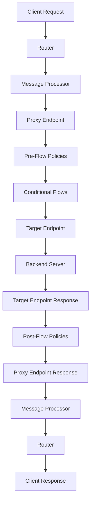

# :leftwards_arrow_with_hook: **Request Flow in Apigee**

## **:gear: Overview**
Apigee follows a structured flow for processing requests and responses. This flow ensures efficient routing, policy enforcement, and communication between the client and the backend target server. The flow consists of **Pre-Flow**, **Proxy Endpoints**, **Target Endpoints**, and **Post-Flow** stages.

---

## **:arrows_clockwise: Request Flow**
1. **Client Request**:
   - The client sends a request to the Apigee Router.
   - The Router directs the request to the appropriate Message Processor (MP).

2. **Proxy Endpoint**:
   - The Proxy Endpoint receives the client request.
   - The request passes through the **Pre-Flow** stage, where general policies (e.g., authentication and rate limiting) are applied.
   - Any conditional flows (conditional routing logic) are processed here.

3. **Target Endpoint**:
   - After processing at the Proxy Endpoint, the request is routed to the **Target Endpoint**.
   - The Target Endpoint prepares the request for the backend server.
   - Additional policies (e.g., transformation, security) may be applied before the request reaches the backend.

4. **Backend Server**:
   - The backend server processes the request and sends the response back to the Target Endpoint.

5. **Target Endpoint Response**:
   - The response from the backend server is processed by the Target Endpoint.
   - Policies such as response transformations are applied.

6. **Proxy Endpoint Response**:
   - The processed response from the Target Endpoint is sent back to the Proxy Endpoint.
   - Additional response-specific policies may be applied in the **Post-Flow** stage.

7. **Response to Client**:
   - The final processed response is sent back to the client through the Message Processor and Router.

---

## **:mag: Visualizing Request Flow in Apigee Edge UI**
In the Apigee Edge UI, the request flow can be observed through the following:

1. **API Proxies**:
   - Navigate to the API Proxy section.
   - View the **Proxy Endpoints** and **Target Endpoints** configurations.

2. **Pre-Flow and Post-Flow**:
   - Open the specific API Proxy and view the Flow Configuration.
   - Pre-Flow policies are visible at the start of the Proxy Endpoint.
   - Post-Flow policies are visible at the end of the Proxy Endpoint.

3. **Policy Attachments**:
   - Check where policies are attached (e.g., Pre-Flow, Post-Flow, or conditional flows).

4. **Trace Tool**:
   - Use the Trace Tool in Apigee to observe real-time request and response processing.
   - The tool displays each policy execution step, including Proxy and Target endpoints.

---

## **:triangular_ruler: Structural Design and Diagram**

### **Components in Request Flow**
- **Client**: Sends the initial API request.
- **Router**: Routes requests to the Message Processor.
- **Message Processor (MP)**: Applies policies and processes the request.
- **Proxy Endpoint**: Handles client-specific logic and Pre-Flow/Post-Flow policies.
- **Target Endpoint**: Handles backend-specific logic and transforms requests/responses.
- **Backend Server**: Processes the API request and returns the response.

### **Flow Diagram**

---

## **:clipboard: Key Notes**
- **Pre-Flow**: Always executes before any conditional or target flows.
- **Post-Flow**: Executes after the request is processed by the backend.
- **Trace Tool**: Provides a step-by-step breakdown of how requests and responses are processed.
- **Default Proxy**: Applies general policies like security, logging, and transformations before reaching the Target Endpoint.

This structured approach ensures security, scalability, and flexibility in API management.
