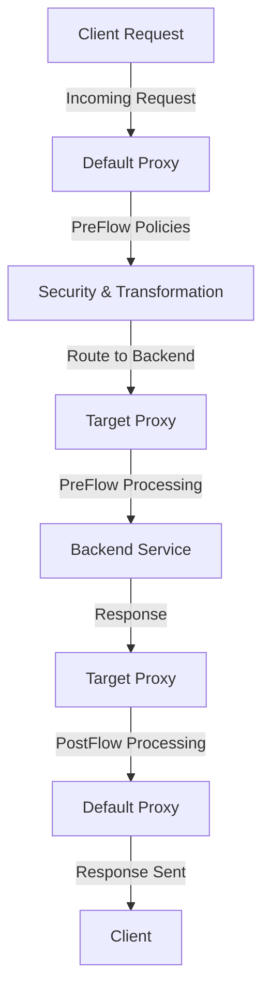

# :rocket: **Creating Your First API Proxy in Apigee**

---

## :bulb: **Introduction**
Apigee allows you to create API proxies that act as an intermediary between clients and backend services. This document provides a step-by-step guide to creating your first API proxy in Apigee, complete with an attractive design and visual representations.

---

## :gear: **Step-by-Step Guide to Creating an API Proxy**

### **Step 1: Log in to Apigee Edge**
1. Navigate to [Apigee Edge](https://apigee.google.com/)
2. Sign in with your Google account.

### **Step 2: Create a New API Proxy**
1. Go to **Develop → API Proxies**.
2. Click **+ Create Proxy**.
3. Choose **Reverse Proxy** (this is the most common type for API requests).
4. Enter the following details:
   - **Proxy Name**: `my-first-proxy`
   - **Base Path**: `/my-first-api`
   - **Target Endpoint**: `https://jsonplaceholder.typicode.com/posts`
   - Click **Next**.

### **Step 3: Configure Policies**
1. In the **PreFlow**, add an API Key validation policy.
2. In the **PostFlow**, log the request details.
3. Click **Save & Deploy**.

### **Step 4: Deploy the Proxy**
1. Choose the environment (e.g., `TEST` or `QA`).
2. Click **Deploy**.
3. Test the proxy by sending a request using Postman or Curl:
   ```bash
   curl -X GET "https://your-apigee-domain.com/my-first-api" -H "x-api-key: YOUR_API_KEY"
   ```

---

## :art: **API Proxy Structure in Apigee**



---

## :framed_picture: **API Proxy Components Overview**

| Component       | Description |
|----------------|-------------|
| **Default Proxy**  | Handles client requests, applies security policies, and routes traffic to the Target Proxy. |
| **Target Proxy**  | Communicates with the backend service, processes responses, and forwards them back to the client. |
| **Policies** | Applied to modify requests/responses (e.g., authentication, logging, and transformations). |

---

## :tada: **Summary**
- **API Proxy**: Acts as a gateway between clients and backend services.
- **Default Proxy**: Manages incoming requests.
- **Target Proxy**: Handles backend communication.
- **Deployment**: Once deployed, you can test the API proxy using Postman or cURL.

By following these steps, you have successfully created and deployed your first API proxy in Apigee! 🚀
