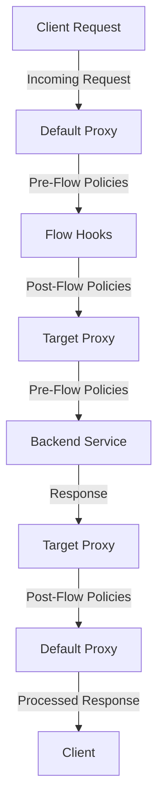

# :arrow_right: **Default Proxy and Target Proxy in Apigee**

---

## :bulb: **Introduction**
Apigee proxies serve as intermediaries between clients and backend services. They consist of two main components:

- **Default Proxy**: Handles incoming client requests.
- **Target Proxy**: Forwards requests to the backend services after processing.

---

## :dart: **Default Proxy**

### **Definition**
The Default Proxy is the entry point for all API traffic. It processes and routes incoming requests from clients to the appropriate backend service through Apigee policies.

### **Key Features**
- Handles client requests.
- Applies policies such as authentication, rate limiting, and transformations.
- Routes traffic to the Target Proxy.

### **Components of Default Proxy**
1. **Pre-Flow**: Policies applied before request processing.
   - Example: Verify API key, Decode JWT.
2. **Flow Hooks**: Executed based on conditional logic.
   - Example: Adding custom headers based on request type.
3. **Post-Flow**: Policies applied after request processing but before sending to the Target Proxy.
   - Example: Logging, Analytics capture.

---

## :dart: **Target Proxy**

### **Definition**
The Target Proxy connects to the backend services. It handles the final leg of the API request by applying additional policies before communicating with the backend.

### **Key Features**
- Establishes a connection with the backend service.
- Applies policies like caching, routing, and transformations.
- Sends the processed response back to the Default Proxy.

### **Components of Target Proxy**
1. **Pre-Flow**: Policies executed before sending the request to the backend.
   - Example: Rewrite URL, Add Authorization Header.
2. **Flow Hooks**: Condition-based policy execution for dynamic scenarios.
   - Example: Switching between backend services based on server health.
3. **Post-Flow**: Policies executed after receiving a response from the backend.
   - Example: Mask sensitive data, Format response payload.

---

## :art: **Visual Representation**

### **Request-Response Flow in Apigee**

---

## :framed_picture: **Component Overview**

### **Default Proxy Example**
- **Pre-Flow**: API Key Validation → Quota Check
- **Flow Hooks**: Conditional Logic (Check User-Agent)
- **Post-Flow**: Logging → Custom Header Addition

### **Target Proxy Example**
- **Pre-Flow**: URL Rewriting → Add Authorization
- **Post-Flow**: Mask Sensitive Data → Response Formatting

---

## :bulb: **Summary**
- **Default Proxy**: Acts as the gateway for API requests, handling all client-side logic.
- **Target Proxy**: Manages communication with backend services, ensuring optimized data exchange.

Together, they form the backbone of Apigee's API management system, enabling scalability, security, and flexibility.
