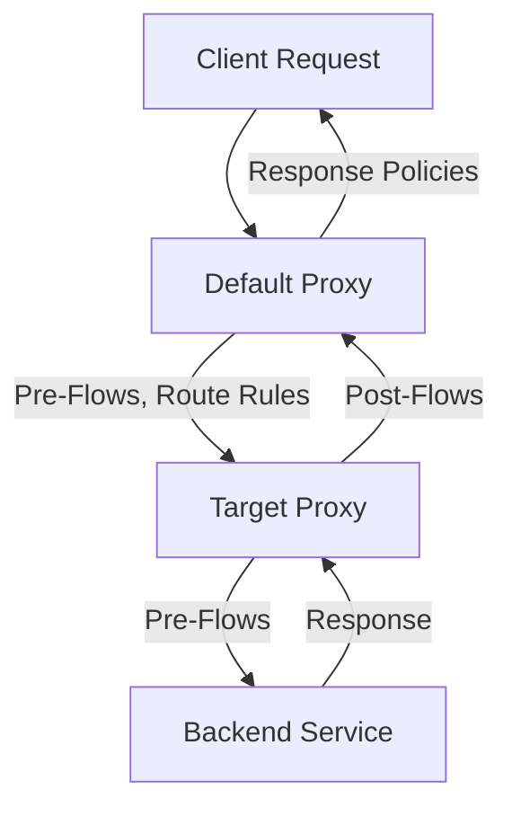

# **Understanding Default Proxy and Target Proxy in Apigee**

## **What is a Default Proxy in Apigee?**

The Default Proxy in Apigee is the entry point for client requests. It represents the API exposed to external consumers and includes configurations for request/response pre-processing and routing logic. This is where policies are applied to manage authentication, throttling, transformations, and more.

### **Key Components of a Default Proxy**
1. **Pre-Flow**:
   - Executes policies before any specific flow is triggered.
   - Example Policies: Authentication, request validation, and logging.

2. **Flows**:
   - Based on conditions (e.g., paths, methods), specific flows are triggered.
   - Example: `/v1/products` routes to a specific backend service.

3. **Post-Flow**:
   - Executes policies after the main flow is processed.
   - Example Policies: Response transformation, analytics logging, and caching.

4. **Route Rules**:
   - Directs the request to the appropriate target proxy or backend service.

---

## **What is a Target Proxy in Apigee?**

The Target Proxy is responsible for connecting the Default Proxy to the backend service. It abstracts the backend details from the client, ensuring security and flexibility.

### **Key Components of a Target Proxy**
1. **Target Endpoint**:
   - Specifies the backend URL (e.g., https://backend.example.com/api).

2. **Target Pre-Flow**:
   - Executes policies before the request is sent to the backend.
   - Example Policies: Header enrichment, authentication with backend credentials.

3. **Target Post-Flow**:
   - Executes policies after receiving the response from the backend.
   - Example Policies: Response transformation, error handling, and logging.

4. **Load Balancing**:
   - Distributes traffic across multiple backend servers for scalability.

---

## **Request Flow Through Apigee**
1. **Client Request**:
   - The client sends a request to the Default Proxy.
2. **Default Proxy Processing**:
   - The request goes through pre-flows, conditional flows, and post-flows.
   - Route rules direct the request to the Target Proxy.
3. **Target Proxy Processing**:
   - The Target Proxy applies pre-flows, routes the request to the backend, and processes post-flows after receiving the backend response.
4. **Response Flow**:
   - The response from the backend is processed by the Target Proxy and sent back to the Default Proxy.
   - The Default Proxy applies response policies and returns the final response to the client.

---

## **Diagram Representation**

---

## **Example in the Apigee UI**

### **Default Proxy**
- **Pre-Flow Policies**: Applied in the "PreFlow" section of the ProxyEndpoint.
- **Conditional Flows**: Managed in the "Flows" section based on request paths and methods.
- **Post-Flow Policies**: Configured in the "PostFlow" section.

### **Target Proxy**
- **Target Pre-Flow**: Policies defined in the "PreFlow" of the TargetEndpoint.
- **Backend URL**: Defined in the `<HTTPTargetConnection>` tag.
- **Target Post-Flow**: Configurations to handle response processing.

---

## **Key Benefits**
1. **Separation of Concerns**:
   - Default Proxy handles client-side processing.
   - Target Proxy manages backend interactions.

2. **Enhanced Security**:
   - Backend details are hidden from the client.

3. **Scalability**:
   - Load balancing and policy execution ensure high performance.

4. **Flexibility**:
   - Easy to update policies or backend configurations without impacting the client.

---

Feel free to enhance the diagram and description further to match your team's specific use case!
